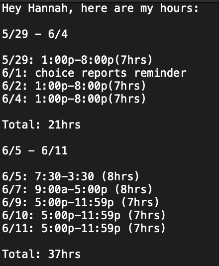

# nexus_schedule_automator

This script will grab the dates that I worked and how many hours I worked on those days and output those values into a text file in a human-readable format. To get the values, I utilized the gspread module.

I created this script to automate the process of submitting time cards to my manager. One drawback is that I have to manually input the worksheets for the given pay period, but it still saves a lot of time. 

## Output 

