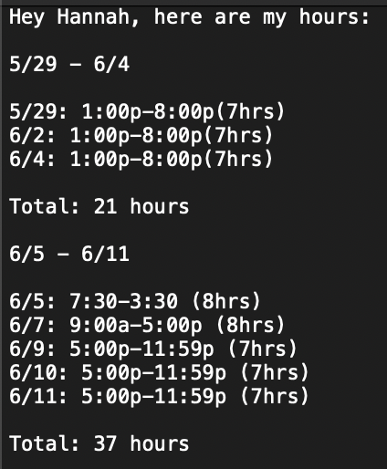

# nexus_schedule_automator

This script will grab the dates that I worked and how many hours I worked on those days and output those values into a text file in a human-readable format. To get the values, I utilized the gspread module.

I created this script to automate the process of submitting time cards to my manager. 

## Output to text file

